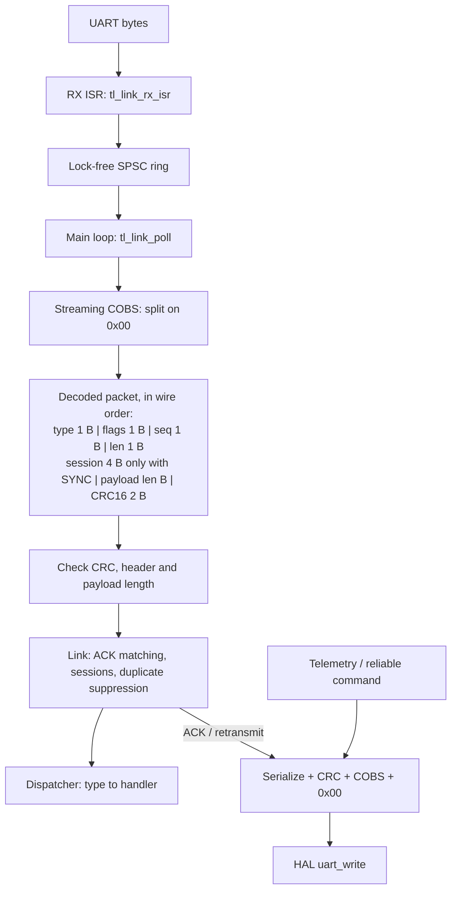

# telelink

A telemetry and command protocol for microcontrollers, written in portable C11 with no dynamic allocation.

[](https://github.com/srujanmalakpata/telelink/actions/workflows/ci.yml)
[](LICENSE)


## Highlights

- **No dynamic allocation, no OS, two HAL callbacks:** the same core runs in host tests,
  a noisy UART simulator and a bare-metal Cortex-M4 example ([design](DESIGN.md#hal-as-a-struct-of-function-pointers)).
- **Lock-free ISR handoff:** load/store-only C11 atomics support Cortex-M0; a two-thread test
  transfers 2,000,000 bytes in order ([verification](VERIFICATION.md#1-2-gcc-build-and-tests)).
- **Restart-aware commands:** stop-and-wait retransmission and session-echo ACKs reject stale
  replies, enforced by `test_stale_ack_from_previous_boot_is_ignored`
  ([design](DESIGN.md#reliability-stop-and-wait-arq-with-duplicate-suppression)).
- **Integrity tested on the wire:** zero wrong packets accepted across 657,984 bit flips and
  82,248 byte drops; residual CRC collision risk remains
  ([verification](VERIFICATION.md#22-wire-level-integrity-with-and-without-the-length-byte-check)).
- **Small embedded footprint:** historical Cortex-M4 cross-build measured 2,800 bytes of library
  text and a 624-byte worst library call chain plus the handler
  ([verification](VERIFICATION.md#9-11-arm-cortex-m4-cross-compile)).

**Tech stack:** C11 · CMake 3.20+ · Ninja · COBS · CRC-16/CCITT-FALSE · pthreads for host tests ·
Clang sanitizers/libFuzzer · GCC ARM Embedded · GitHub Actions.

**Validation:** Release tests, sanitizers and the deterministic sweep were run locally; historical
Linux fuzzing and ARM measurements are preserved in [VERIFICATION.md](VERIFICATION.md).
The [latest local check](VERIFICATION.md#2026-10-03-local-check) lists current results and blockers.
Firmware has never been flashed or run
on hardware or QEMU.

Contents: [Quickstart](#quickstart) · [Architecture](#architecture) · [Device integration](#device-integration) ·
[Features](#features) · [Testing](#testing) · [Results](#results) · [Limitations](#limitations)

## Quickstart

Requirements: Git, CMake 3.20+, Ninja, and a C11 compiler (GCC or Clang). No external library
is needed. The sweep prints delivery/error counts and exits nonzero on duplicate or corrupt
application delivery or a simulation timeout.

```sh
git clone https://github.com/srujanmalakpata/telelink.git
cd telelink
cmake -S . -B build -G Ninja -DCMAKE_BUILD_TYPE=Release
cmake --build build
ctest --test-dir build --output-on-failure
./build/tl_sim --sweep --seed 42
```

## Architecture



For the simulator's 24-byte telemetry payload (no SYNC):

| Layer | Bytes |
|---|---:|
| Header (`type`, `flags`, `seq`, `len`) | 4 |
| Payload | 24 |
| CRC-16, big-endian, covering header and payload | 2 |
| **Decoded packet** | **30** |
| COBS overhead | 1 |
| Delimiter (`0x00`) | 1 |
| **Wire frame** | **32** |

The size is enforced by `test_telemetry_wire_size` in `tests/test_packet.c`
([verification](VERIFICATION.md#2026-10-03-local-check)). SYNC commands and their ACKs also carry
a four-byte session covered by the CRC. Detailed receive and retransmit flow:

```
            ISR context                        main-loop context
  UART RX ─► tl_link_rx_isr() ─► [SPSC ring] ─► tl_link_poll()
                                                   │
                                   tl_cobs_stream_feed()  (byte by byte, splits on 0x00)
                                                   │ FRAME_READY / ERR_FRAMING / ERR_OVERFLOW
                                 tl_packet_parse()  (size, CRC-16, header, length byte)
                                                   │
                         ┌─────────────────────────┼─────────────────────────┐
                    ACK flag                  RELIABLE flag               unreliable
        if type, seq (+session) match:  send ACK; SYNC with a new             │
             clear pending tx,          session id -> forget last seq;        │
             call on_tx_done            drop duplicate seq, else ───────► tl_dispatch()
                                                                       (type -> handler)
  tl_link_send() / tl_link_send_reliable()
        └─► tl_frame_encode() = COBS(type|flags|seq|len|[session]|payload|CRC) + 0x00 ─► uart_write()
  tl_link_poll() also: if (tick - sent_at >= timeout) retransmit or give up after max_retries

  HAL (function pointers): uart_write(ctx, data, len), get_tick_ms(ctx)
```

| Directory | Contents |
|---|---|
| `include/tl/`, `src/` | the portable library (`libtl`) |
| `sim/` | noisy channel model, two-endpoint simulation, `tl_sim` CLI |
| `tests/` | minimal C11 harness (`tl_test.h`) and 9 test binaries run by CTest |
| `fuzz/` | libFuzzer targets and seed generator |
| `examples/cortex-m4/` | bare-metal STM32F4-style example: startup, linker script, USART2 ISR |
| `cmake/arm-none-eabi.cmake`, `cmake/arm-none-eabi-cortex-m0.cmake` | cross-compilation toolchain files (Cortex-M4, Cortex-M0) |

Design rationale and alternatives are in [DESIGN.md](DESIGN.md).

## Device integration

```c
static tl_link link;
static uint8_t rx_ring[128];                       /* power of two */

void USART_IRQHandler(void) { tl_link_rx_isr(&link, UART->DR); }

int main(void) {
    tl_hal hal = { .ctx = NULL, .uart_write = my_uart_write, .get_tick_ms = my_millis };
    tl_link_config cfg = { .retransmit_timeout_ms = 50, .max_retries = 5,
                           .session_id = my_boot_counter_or_rng() };  /* new value every boot */
    tl_link_init(&link, &cfg, &hal, rx_ring, sizeof rx_ring);
    tl_link_register(&link, MSG_SET_RATE, on_set_rate, NULL);
    for (;;) { tl_link_poll(&link); /* ... tl_link_send(&link, MSG_TELEMETRY, buf, n); */ }
}
```

## Features

It turns a noisy UART byte stream into validated, dispatched packets:
an interrupt handler hands bytes to the main loop through a lock-free SPSC ring buffer, a
streaming COBS decoder finds frame boundaries, CRC-16/CCITT-FALSE plus a length cross-check
reject corruption, and a stop-and-wait ACK/retransmit layer suppresses duplicate commands
while both ends stay up (duplicates can recur across a receiver reboot). Commands may fail
after retries are exhausted; see [Limitations](#limitations). The core never touches
a real clock or register (all I/O goes through a two-function HAL), so the same code runs in host
unit tests, in a libFuzzer harness, in a seeded noisy-wire simulator, and in a Cortex-M4 image.

- **Lock-free SPSC ring buffer** (`src/ringbuf.c`): C11 atomics with documented acquire/release
  ordering, free-running 32-bit counters (all slots usable, wrap-safe), load/store only (no
  read-modify-write), so it stays lock-free on Cortex-M0, which has no LDREX/STREX (the M0 library
  build is checked for libatomic calls). Stress-tested with two threads under ThreadSanitizer.
- **COBS framing** (`src/cobs.c`): canonical encoder, one-shot decoder, and a byte-at-a-time
  streaming decoder that reports `FRAME_READY`, `ERR_FRAMING` or `ERR_OVERFLOW` per delimiter and
  resynchronises on the next `0x00`.
- **CRC-16/CCITT-FALSE** (`src/crc16.c`): 256-entry table in flash plus a bitwise reference;
  checked against the catalogue value (`"123456789"` -> `0x29B1`) and Python's `binascii.crc_hqx`.
- **Packet format** (`src/packet.c`): `type | flags | seq | len | [session] | payload | CRC16`.
  Frames are delimited by COBS, never by `len`; the length byte is a cross-check that rejects a
  frame which lost or gained bytes even when its last two bytes happen to pass as a CRC. Strict
  header validation is shared by the serializer and the parser.
- **Command dispatcher** (`src/dispatch.c`): fixed table of `type -> handler(ctx)`.
- **Link endpoint** (`src/link.c`): RX state machine with error counters (bad CRC, framing,
  overflow, bad header, bad length, duplicates, unknown type, stale ACKs, new sessions, ISR ring
  drops), fire-and-forget telemetry, and reliable commands with ACKs matched by (type, seq),
  duplicate suppression, retransmit timeouts driven by an injected millisecond tick (wrap-around
  safe), and a per-boot session id (SYNC flag) so a restarted sender's commands are not mistaken
  for duplicates. The ACK of a SYNC frame echoes the session id, so an ACK meant for the sender's
  previous boot cannot complete a new command. An ACK means "received intact", not "handled"
  (see `include/tl/link.h`). Callers read state through accessors (`tl_link_get_stats`,
  `tl_link_rx_pending`, `tl_link_rx_ring_dropped`, `tl_link_tx_busy`).
- **Host simulator** (`sim/`): two endpoints joined by a simulated UART with seeded bit flips and
  dropped bytes; reports delivery statistics, exits 1 if a duplicate or corrupted message ever
  reaches a handler and 3 if a run hits its simulated-time limit before finishing.
- **Tooling**: CMake, `-Wall -Wextra -Werror` (plus `-Wconversion -Wsign-conversion` on the
  library), ASan/UBSan and TSan builds, two libFuzzer targets, ARM Cortex-M4 cross-compile with
  size and stack-usage reports, Cortex-M0 library build, GitHub Actions CI.

## Testing

```sh
# Single run: 1000 commands + 1000 telemetry frames, 1% flips and 1% drops per byte
./build/tl_sim --seed 42 --flip-ppm 10000 --drop-ppm 10000

# Sanitizers (clang)
CC=clang cmake -S . -B build-asan -DCMAKE_BUILD_TYPE=Debug -DTL_SANITIZE=address,undefined
CC=clang cmake -S . -B build-tsan -DCMAKE_BUILD_TYPE=Debug -DTL_SANITIZE=thread
cmake --build build-asan && ctest --test-dir build-asan
cmake --build build-tsan && ctest --test-dir build-tsan

# Fuzzing (clang + compiler-rt, e.g. apt install libclang-rt-18-dev)
CC=clang cmake -S . -B build-fuzz -DTL_BUILD_FUZZ=ON -DTL_BUILD_TESTS=OFF -DTL_BUILD_SIM=OFF
cmake --build build-fuzz
mkdir -p corpus_cobs && ./build-fuzz/fuzz_cobs -max_total_time=60 corpus_cobs fuzz/seeds
mkdir -p corpus_link && ./build-fuzz/fuzz_link -max_total_time=60 corpus_link fuzz/seeds

# Cortex-M4 cross-compile (apt install gcc-arm-none-eabi libnewlib-arm-none-eabi)
cmake -S . -B build-arm -DCMAKE_TOOLCHAIN_FILE=cmake/arm-none-eabi.cmake -DCMAKE_BUILD_TYPE=MinSizeRel
cmake --build build-arm && arm-none-eabi-size build-arm/libtl.a build-arm/firmware.elf

# Cortex-M0 library build + check that no libatomic call is needed
cmake -S . -B build-m0 -DCMAKE_TOOLCHAIN_FILE=cmake/arm-none-eabi-cortex-m0.cmake \
      -DCMAKE_BUILD_TYPE=MinSizeRel -DTL_BUILD_FIRMWARE_EXAMPLE=OFF
cmake --build build-m0 && ! arm-none-eabi-nm -u build-m0/libtl.a | grep -E '__(atomic|sync)_'

# Formatting
find include src sim tests fuzz examples -name '*.[ch]' | xargs clang-format --dry-run -Werror
```

## Results

Measured on a 4-vCPU Linux container (x86_64, Ubuntu 24.04, gcc 13.3 / clang 18.1.3 /
arm-none-eabi-gcc 13.2.1, shared with other jobs, load average about 16), 2026-10-03. Full
test record in [VERIFICATION.md](VERIFICATION.md).

**Historical Linux tests**: 62 test cases (23,212 checks) in 9 binaries passed with gcc, clang,
ASan+UBSan and TSan builds. Line coverage of `src/` from the unit/integration tests: 418 of 423 lines (98.8%, gcov).
Two of them use real threads: a 2,000,000-byte SPSC ring-buffer stress test, and a link test in
which a second thread plays the UART ISR and feeds 20,000 encoded frames while the main thread
runs `tl_link_poll`; all frames arrive in order.

**Fuzzing** (60 s per target, ASan+UBSan, no crashes): `fuzz_cobs` 2,367,700 executions,
`fuzz_link` 911,209 executions (counts depend on machine load and vary from run to run).

**Wire-level integrity** (`test_wire_bit_flips_and_drops`: every bit flipped and every byte
dropped, one at a time, in 2,000 random encoded frames; wrong packets that still parsed OK):

| Error on the wire | Trials | Accepted wrong, CRC + length byte | Accepted wrong, length check disabled |
|---|---:|---:|---:|
| flip in a COBS data byte (stays non-zero) | 565,621 | 0 (guaranteed) | 0 |
| flip that creates a `0x00` (early delimiter) | 6,913 | 0 | 10 |
| flip in a COBS code byte (stays non-zero) | 85,450 | 0 (CRC only, ~2^-16 each) | 0 |
| one byte dropped | 82,248 | 0 | 11 |

End to end, at 1% flips + 1% drops per byte, the simulator delivered a corrupted message in 64
of 1,000 seeds with the length check disabled (52 commands, 12 telemetry frames), and in 0 of
1,000 with it.

**Footprint** (`-Os`, `arm-none-eabi-size`, `.text` bytes):

| Object | Cortex-M4 | Cortex-M0 |
|---|---:|---:|
| link.c | 1,104 | 1,118 |
| crc16.c (incl. 512-byte table) | 608 | 624 |
| packet.c | 402 | 430 |
| cobs.c | 360 | 382 |
| ringbuf.c | 206 | 212 |
| dispatch.c | 120 | 122 |
| **library total** | **2,800** | **2,888** |
| example firmware image (`firmware.elf`, M4 only) | 3,644 text, 4 data, 548 bss | - |

The Cortex-M0 library needs no libatomic calls (`arm-none-eabi-nm -u` shows no `__atomic_*`
symbols); `tl_rb_push` compiles to `ldr`/`str` plus two `dmb ish` on both cores.

**Stack** (Cortex-M4, `-fstack-usage`): largest frames `tl_link_poll` 296 B, `tl_link_send`
168 B, `tl_link_send_reliable` 104 B, `tl_frame_encode` 96 B. Worst library call chain (a
handler that replies from inside poll): `tl_link_poll` -> `tl_dispatch` -> handler ->
`tl_link_send` -> `tl_frame_encode` -> `tl_packet_serialize` -> CRC = 624 B plus the handler's own
frame. It grows with `TL_MAX_PAYLOAD`, because a send copies the payload into a stack packet, a
raw buffer and the encoded frame.

**Noisy-wire simulation** (`tl_sim --sweep --seed 42`; 1000 reliable commands host->device and
1000 best-effort 24-byte telemetry frames device->host, 11 bytes/ms ~ 115200 baud, retransmit
timeout 20 ms, 8 retries; "flip" and "drop" are per-byte probabilities in each direction).
Output is bit-identical between the gcc and clang builds, and `tl_sim` exits 0 (it exits 1 if a
duplicate or corrupted message reaches a handler, 3 if a run does not finish).

| flip ppm | drop ppm | commands delivered | commands reported failed | retransmits | telemetry delivered | bad CRC | framing errors | duplicate deliveries | undetected corruption | simulated ms |
|---:|---:|---:|---:|---:|---:|---:|---:|---:|---:|---:|
| 0 | 0 | 1000/1000 | 0 | 0 | 1000/1000 | 0 | 0 | 0 | 0 | 4999 |
| 100 | 100 | 1000/1000 | 0 | 11 | 996/1000 | 6 | 10 | 0 | 0 | 5175 |
| 1000 | 1000 | 1000/1000 | 0 | 80 | 934/1000 | 67 | 73 | 0 | 0 | 6323 |
| 5000 | 5000 | 1000/1000 | 0 | 393 | 706/1000 | 338 | 314 | 0 | 0 | 12236 |
| 10000 | 10000 | 1000/1000 | 0 | 901 | 519/1000 | 619 | 706 | 0 | 0 | 22205 |
| 20000 | 20000 | 985/1000 | 74 | 2517 | 270/1000 | 1291 | 1846 | 0 | 0 | 55595 |

No command was ever delivered twice to the application (both ends stay up in the simulator). A
"failed" command means the sender gave up; many of those were in fact delivered and only the
ACKs were lost (at 2% + 2%: 926 ACKed, 74 reported failed, 985 delivered, so 59 of the "failed"
commands did arrive). In the 2% single run the host's length check rejected one truncated frame
whose CRC had matched (`bad_length 1`). Telemetry has no retransmission, so its delivery rate
tracks the per-frame survival probability: a telemetry frame is 32 bytes on the wire, so about
0.99^32 = 72.5% at 0.5% + 0.5% per byte (measured 70.6%). "Undetected corruption: 0" is
evidence for these seeds, not a guarantee (see Limitations).

## Limitations

- **Not run on hardware.** The Cortex-M4 example compiles, links and is size-checked, and the
  library compiles for Cortex-M0, but nothing has ever been flashed; its register addresses follow the STM32F405/407 reference manual and need
  checking against a real part. No QEMU run either.
- **Stop-and-wait, window of 1.** Throughput of reliable commands is limited to one per
  round-trip. Fine for commands, wrong for bulk transfer.
- **Sender restarts depend on `session_id`.** A restarted sender's sequence numbers start at 0
  again. The SYNC flag + per-boot `session_id` makes the receiver forget its last sequence number,
  but only if the application really supplies a new id on every boot (boot counter or RNG). With
  a constant id, the first command after a restart can be ACKed but dropped as a duplicate (a
  unit test shows this). ACKs of SYNC frames echo the session id, so a stale ACK addressed to the
  sender's previous boot is ignored; that protection covers the SYNC phase (until the first ACK),
  which is when such stale ACKs arrive.
- **Receiver reboots make delivery at-least-once.** The receiver's duplicate memory (last session
  and sequence number) lives in RAM. If it reboots after dispatching a command but before its ACK
  reaches the sender, the sender retransmits and the rebooted receiver runs the command again
  (`test_receiver_restart_in_ack_window_duplicates` pins this). Make commands idempotent, or keep
  that state in backup/no-init RAM if exactly-once must survive a reset. A reboot after the ACK
  got through loses nothing.
- **8-bit sequence numbers, one-entry duplicate memory.** If 255 reliable frames in a row are
  abandoned without reaching the receiver, the next one is taken for a duplicate (and ACKed).
- **An ACK means "received intact", not "handled".** A reliable frame for a type with no handler
  is ACKed and counted only in the receiver's `rx_unknown_type`.
- **What the integrity checks guarantee.** CRC-16 detects every single-bit error and every burst
  up to 16 bits *in the decoded packet*. On the wire that holds for a flipped COBS data byte, but a
  flip that hits a COBS code byte moves the implied zeros, and a flip to `0x00` or a dropped byte
  shortens the frame. The length byte rejects the length-changing cases unless the error hit the
  length byte itself; code-byte flips that keep the length are caught only with probability about
  1 - 2^-16. Random corruption in general slips through with probability about 2^-16 per bad
  frame. There is no authentication.
- **The simulator's noise model is simple**: independent per-byte flips and drops, no burst
  errors, no baud-rate mismatch, no UART framing/parity errors. Results depend on the seed.
- **Not thread-safe beyond the documented model**: one ISR producer, one main-loop consumer.
- **The "ISR" in host tests is a thread or a function call**: TSan checks the C11 memory model on
  host CPUs; it does not prove behaviour on a specific MCU.

## License

MIT, see [LICENSE](LICENSE).
